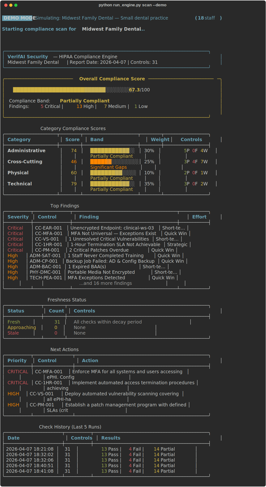
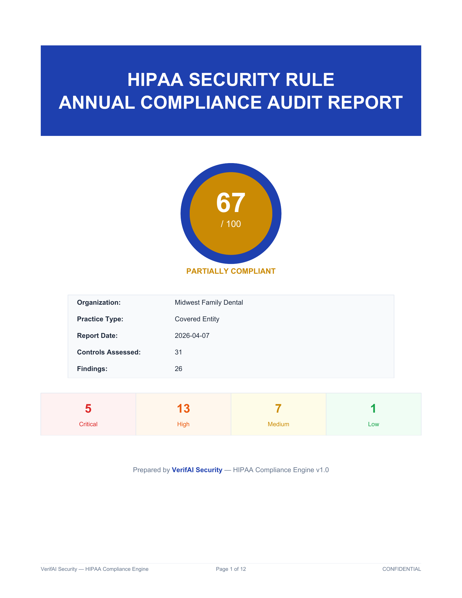
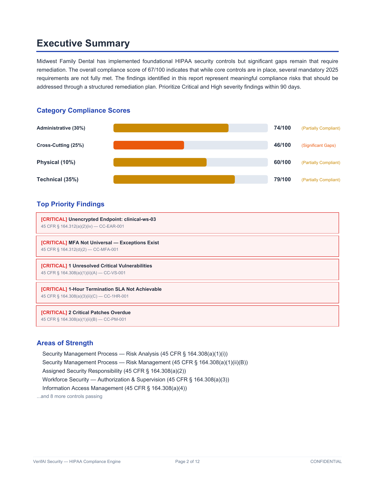
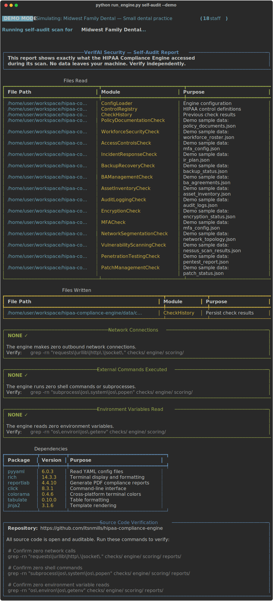

# HIPAA Compliance Engine

**VerifAI Security** — Continuous compliance monitoring for the 2025 HIPAA Security Rule

[](https://www.python.org/downloads/)
[](LICENSE)

A Python-based continuous compliance monitoring engine that **actively verifies technical controls** against every mandatory requirement in the 2025 HIPAA Security Rule NPRM. Unlike questionnaire-based tools, this engine checks MFA enforcement, encryption status, scan schedules, log collection, and more — then tracks compliance freshness over time.

---

### Compliance Dashboard

<p align="center">
  
</p>

### PDF Audit Report

<p align="center">
  
  
</p>

### Self-Audit Transparency Report

<p align="center">
  
</p>

---

## Features

- **31 Mandatory Controls** — Maps every control from the 2025 HIPAA Security Rule NPRM (Administrative, Physical, Technical, and Cross-Cutting safeguards)
- **14 Check Modules** — Automated verification of MFA, encryption, vulnerability scanning, penetration testing, network segmentation, access controls, audit logging, incident response, backup/DR, asset inventory, BA management, workforce security, policy documentation, and patch management
- **Compliance Freshness Scoring** — Time-decay model where scores degrade based on check age. Continuous controls decay over 30 days, semi-annual over 180 days, annual over 365 days
- **Professional PDF Reports** — 20+ page branded annual compliance audit report with score gauges, category breakdowns, detailed findings, risk register, and methodology section
- **Rich Terminal Dashboard** — Beautiful terminal UI showing overall score, per-category breakdown, freshness status, next actions, and historical trend
- **Demo Mode** — Simulates "Midwest Family Dental" (18-person dental practice) with realistic mixed compliance (~67% score)
- **Check History** — Persists results across runs for freshness tracking and trend analysis
- **CSV/JSON Export** — Export findings for integration with other tools

## Privacy & Data Handling

**This tool makes zero network connections. All data stays on your local machine.**

The HIPAA Compliance Engine is designed for environments where data privacy is paramount. Here's exactly what the tool does and doesn't do:

### What the tool DOES
- Reads configuration files you provide (config.yaml)
- Reads evidence files you point it to (JSON/CSV exports from your existing tools)
- Reads its own control definitions (bundled YAML)
- Writes check results to a local history file (data/check_history.json)
- Writes PDF reports to a local output folder (output/)

### What the tool DOES NOT do
- Makes no network connections of any kind
- Sends no data to any server, cloud, or third party
- Runs no shell commands or subprocesses
- Reads no environment variables
- Accesses no files outside the paths you explicitly configure
- Requires no API keys, tokens, or credentials

### Verify It Yourself

Run the built-in self-audit to see exactly what files are accessed:
```bash
python run_engine.py self-audit --demo
```

Or verify the source code directly:
```bash
# Confirm zero network calls
grep -rn "requests\|urllib\|http\.\|socket\." checks/ engine/ scoring/ reports/

# Confirm zero shell commands
grep -rn "subprocess\|os\.system\|os\.popen" checks/ engine/ scoring/ reports/

# Confirm zero environment variable reads
grep -rn "os\.environ\|os\.getenv" checks/ engine/ scoring/ reports/
```

### For Your IT Team / Auditor
The complete source code is available at [github.com/itsnmills/hipaa-compliance-engine](https://github.com/itsnmills/hipaa-compliance-engine). Every line is auditable. The `self-audit` command provides a complete transparency report showing exactly what the tool accessed during any scan. We encourage your IT team to review the code before running it in your environment.

---

## Quick Start

### Installation

```bash
git clone https://github.com/itsnmills/hipaa-compliance-engine.git
cd hipaa-compliance-engine
pip install -r requirements.txt
```

### Demo Mode (No Configuration Required)

```bash
# Run a full compliance scan with simulated data
python run_engine.py scan --demo

# Generate the annual compliance audit PDF report
python run_engine.py report --demo

# View the compliance dashboard
python run_engine.py dashboard --demo

# View freshness status for all controls
python run_engine.py freshness --demo

# Check a specific control
python run_engine.py check CC-MFA-001 --demo

# Export findings to CSV
python run_engine.py export --demo --format csv
```

### Production Mode

1. Copy `config.yaml` and customize for your environment
2. Configure identity provider, server, network, and scanner settings
3. Set evidence file paths

```bash
# Full compliance scan
python run_engine.py scan

# Generate PDF report
python run_engine.py report --output my_report.pdf

# Scan specific category
python run_engine.py scan --category technical
```

## CLI Commands

| Command | Description |
|---------|-------------|
| `scan [--demo] [--category CAT]` | Run full compliance scan |
| `dashboard [--demo]` | View compliance dashboard |
| `report [--demo] [--output PATH]` | Generate PDF audit report |
| `freshness [--demo]` | View freshness status for all controls |
| `check CONTROL_ID [--demo]` | Run check for specific control |
| `control CONTROL_ID` | Show control definition details |
| `export [--demo] [--format csv\|json]` | Export findings |
| `history` | View check history |
| `self-audit [--demo]` | Show exactly what files the engine reads/writes |

## Architecture

```
hipaa-compliance-engine/
├── run_engine.py                    # CLI entrypoint (Click)
├── config.yaml                      # Production configuration
├── config_demo.yaml                 # Demo mode configuration
├── engine/
│   ├── orchestrator.py              # Main execution orchestrator
│   ├── config.py                    # Configuration loader
│   ├── models.py                    # Data models (dataclasses)
│   ├── audit_trail.py               # File access tracking (self-audit)
│   └── exceptions.py               # Custom exceptions
├── controls/
│   ├── registry.py                  # Control registry loader
│   └── control_definitions.yaml     # All 31 HIPAA controls (YAML)
├── checks/
│   ├── base.py                      # Abstract base check class
│   ├── mfa.py                       # MFA enforcement
│   ├── encryption.py                # Encryption at rest & transit
│   ├── vulnerability_scanning.py    # Vulnerability scan compliance
│   ├── penetration_testing.py       # Annual pen test evidence
│   ├── network_segmentation.py      # Network isolation
│   ├── access_controls.py           # RBAC & unique user IDs
│   ├── audit_logging.py             # Centralized logging
│   ├── incident_response.py         # IR plan & testing
│   ├── backup_recovery.py           # Backup & 72-hour DR
│   ├── asset_inventory.py           # Asset inventory & network map
│   ├── ba_management.py             # Business associate oversight
│   ├── workforce_security.py        # Training & termination
│   ├── policy_documentation.py      # Written policies + directory scan
│   └── patch_management.py          # Patch compliance
├── scoring/
│   ├── freshness.py                 # Time-decay freshness model
│   └── risk_calculator.py           # Risk scoring utilities
├── reports/
│   ├── pdf_generator.py             # ReportLab PDF report
│   ├── dashboard.py                 # Rich terminal dashboard
│   └── templates.py                 # Report text & color templates
├── templates/                       # Evidence file templates
│   ├── README.md                    # Template preparation guide
│   ├── mfa_config_template.json
│   ├── encryption_status_template.json
│   ├── vulnerability_scans_template.json
│   ├── ... (14 templates total)
│   ├── asset_inventory_template.csv  # CSV alternative
│   └── workforce_roster_template.csv # CSV alternative
├── demo/
│   ├── simulator.py                 # Demo mode utilities
│   └── sample_data/                 # 13 simulated data files
├── data/
│   └── check_history.json           # Persistent check history
└── output/                          # Generated reports
```

## Compliance Freshness Model

The engine's core differentiator is its **freshness scoring** system. Every check result decays over time:

```
freshness = max(0, 1.0 - (days_since_check / decay_period))
effective_score = check_score × freshness
```

| Control Type | Decay Period | Example |
|-------------|-------------|---------|
| Continuous | 30 days | MFA, encryption, logging, patches |
| Semi-annual | 180 days | Vulnerability scanning, access reviews |
| Annual | 365 days | Pen testing, risk analysis, BA verification |

### Overall Score = Weighted Average

| Category | Weight |
|----------|--------|
| Technical Safeguards | 35% |
| Administrative Safeguards | 30% |
| Cross-Cutting (2025 Mandatory) | 25% |
| Physical Safeguards | 10% |

### Score Bands

| Score | Band | Color |
|-------|------|-------|
| 95-100 | Fully Compliant | Green |
| 80-94 | Substantially Compliant | Light Green |
| 60-79 | Partially Compliant | Yellow |
| 40-59 | Significant Gaps | Orange |
| 0-39 | Non-Compliant | Red |

## Demo Mode: Midwest Family Dental

> Try it now: `python run_engine.py scan --demo`

The demo simulates a realistic 18-person dental clinic with mixed compliance:

- **MFA** is enforced but 1 temp worker has an exception
- **Encryption** covers most systems but 1 workstation is unencrypted
- **Network segmentation** has lateral movement risks (SMB between VLANs)
- **Vulnerability scanning** found 1 unresolved critical CVE
- **Penetration testing** has 1 open high-severity finding (VLAN segmentation)
- **Business associates** — 1 BAA expired, 1 BA missing annual verification
- **Training** — 2 staff members have expired/missing training
- **Patch management** — 2 critical patches overdue past 14-day SLA
- **Access termination** — Cannot achieve 1-hour SLA (manual process averages 95 min)

Overall score: **~67/100 (Partially Compliant)**

## PDF Report

The generated PDF includes:

1. Cover page with compliance score gauge
2. Executive summary with category breakdown
3. Compliance score dashboard with visual bars
4. Detailed findings per category with CFR references
5. Control coverage matrix (all 31 controls)
6. Business associate compliance section
7. Risk register sorted by severity
8. Methodology & disclaimer

## 2025 HIPAA Security Rule Coverage

This engine maps all mandatory controls from the 2025 NPRM, including new requirements:

- **Universal MFA** (no longer addressable — mandatory for all ePHI access)
- **AES-256 Encryption at Rest** (mandatory for all covered entities)
- **Network Microsegmentation** (prevent lateral movement)
- **Semi-Annual Vulnerability Scanning** (automated, every 180 days)
- **Annual Penetration Testing** (by qualified professional)
- **72-Hour System Restoration** (DR must restore critical systems)
- **24-Hour BA Contingency Notification** (in all BAAs)
- **Annual BA Verification** (written, SME-certified)
- **1-Hour Access Termination** (upon employment end)
- **Complete Technology Asset Inventory** (reviewed annually)

## Evidence File Preparation

The engine supports **file-import mode** for production use. Instead of live API connections, you export data from your existing tools into JSON/CSV files and point the engine at them.

### Setup Steps

1. Review `templates/` for the expected format of each evidence file
2. Export data from your existing tools (Nessus, Azure AD, Veeam, etc.)
3. Save exports to a directory on your machine
4. Update `config.yaml` with the file paths under the `evidence:` section
5. Run `python run_engine.py scan` to verify

### Policy Directory Scan

For policy documents, you can either provide a JSON manifest or point `policies_dir` at a directory of actual policy files (`.pdf`, `.docx`, `.md`, `.txt`). The engine will:

- Match files by expected filename patterns (e.g., `risk_analysis.pdf`, `incident_response.docx`)
- Check modification dates to verify policies have been reviewed within 12 months
- Report missing and overdue policies

### Self-Audit

Run `python run_engine.py self-audit --demo` to see a complete transparency report of every file the engine reads and writes during a scan.

## Extending

### Adding a New Check Module

1. Create `checks/my_check.py` extending `BaseCheck`
2. Implement `execute()` and `get_evidence()`
3. Add control definitions to `control_definitions.yaml`
4. Register the module in `engine/orchestrator.py` `CHECK_MODULE_MAP`

### Adding API Integrations

Each check module supports both live (API) and demo (file) modes. To add a live integration:

1. Add API credentials to `config.yaml`
2. Implement the live check path in the module's `execute()` method
3. Use the config to determine check method (api vs file_import)

## Dependencies

- `pyyaml` — Configuration parsing
- `rich` — Terminal dashboard and progress bars
- `reportlab` — PDF report generation
- `click` — CLI framework
- `colorama` — Cross-platform terminal colors
- `tabulate` — Table formatting
- `jinja2` — Template support

## Portfolio Context

| Tool | Purpose |
|------|---------|
| `hipaa-risk-assessment` | Questionnaire-based compliance (asks humans questions) |
| `hipaa-compliance-engine` | Technical controls verification (checks the environment) |

Together they form a complete HIPAA compliance platform for the VerifAI Security MSP offering.

## License

MIT License — See [LICENSE](LICENSE) for details.

---

Built by **VerifAI Security** — Protecting healthcare data through continuous compliance monitoring.
